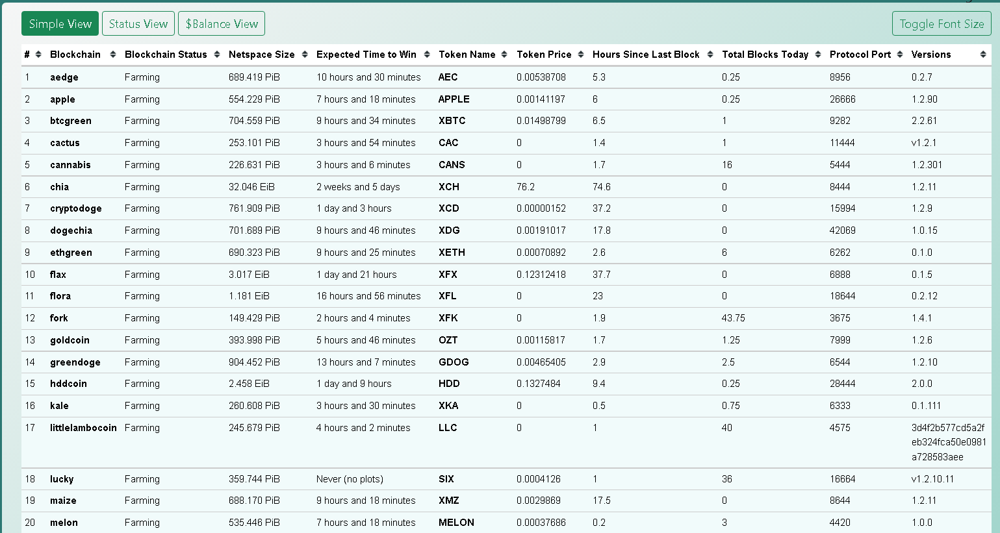
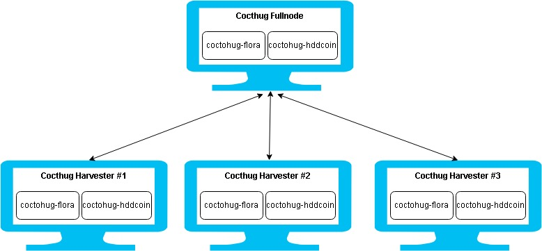

# Coctohug - 웹 브라우저에서 수십 개의 chia 블록체인 포크 마이닝을 관리하세요!
- 수십 가지 언어를 지원하는 멋진 현지화: [English](./readme_en.md), [العربية](./readme_ar.md), [Bulgarian](./readme_bg.md), [Catalan](./readme_ca.md), [Deutsch](./readme_de.md), [Español](./readme_es.md), [زبان فارسی](./readme_fa.md), [Français](./readme_fr.md), [Galego](./readme_gl.md), [Indonesian](./readme_id.md), [Italiano](./readme_it.md), [日本語](./readme_ja.md), [한국어](./readme_ko.md), [Português do Brasil](./readme_pt.md), [limba română](./readme_ro.md), [Русский](./readme_ru.md), [Serbian](./readme_sr.md), [Thai](./readme_th.md), [Tagalog (Filipino)](./readme_tl.md), [Türkçe](./readme_tr.md), [Українська](./readme_uk.md), [Vietnamese](./readme_vi.md), [简体中文](./readme_zh-CN.md), [繁體中文](./readme_zh-TW.md)
- 지원: [cactus](https://github.com/raingggg/coctohug-cactus), [covid](https://github.com/raingggg/coctohug-covid), [cryptodoge](https://github.com/raingggg/coctohug-cryptodoge), [ethgreen](https://github.com/raingggg/coctohug-ethgreen), [flora](https://github.com/raingggg/coctohug-flora), [greendoge](https://github.com/raingggg/coctohug-greendoge), [lucky](https://github.com/raingggg/coctohug-lucky) [pipscoin](https://github.com/raingggg/coctohug-pipscoin), [shibgreen](https://github.com/raingggg/coctohug-shibgreen), [silicoin](https://github.com/raingggg/coctohug-silicoin), [skynet](https://github.com/raingggg/coctohug-skynet) [staicoin](https://github.com/raingggg/coctohug-staicoin), [stor](https://github.com/raingggg/coctohug-stor), [tranzact](https://github.com/raingggg/coctohug-tranzact), [venidium](https://github.com/raingggg/coctohug-venidium), 그리고 더...
- Linux, Windows, MacOS 등에서 실행...

를 사용하여 쉬운 설정 [빠른 시작](https://www.coctohug.xyz/) & [Coctohug 명령 관리자](../ccm/ccm_ko.md)

*더 많은 도움을 받으십시오. [Website](https://www.coctohug.xyz/) / [Github](https://github.com/raingggg/coctohug) / [Discussions](https://github.com/raingggg/coctohug/discussions) / [Discord](https://discord.com/invite/RcVpCw3ef7)*.

*[자세한 사용 설명서는 다음과 같습니다.](../wiki/wiki_ko.md)*

## Table View

## Harevster 설정 다이어그램

## 영어 스크린샷

## 중국어 스크린샷

## 러시아어 스크린샷

## 독일어 스크린샷

## 상표권 고지
CHIA NETWORK INC, CHIA™, CHIA BLOCKCHAIN™, CHIA PROTOCOL™, CHIALISP™ 및 &#34;잎 로고&#34;(Chia를 지칭하거나 나타내는 경우 잎 로고만 포함)는 Chia Network, Inc.의 상표 또는 등록 상표입니다. ., 델라웨어 기업. *이 Coctohug 프로젝트와 주요 Chia Network 프로젝트 사이에는 아무런 관련이 없습니다.*
