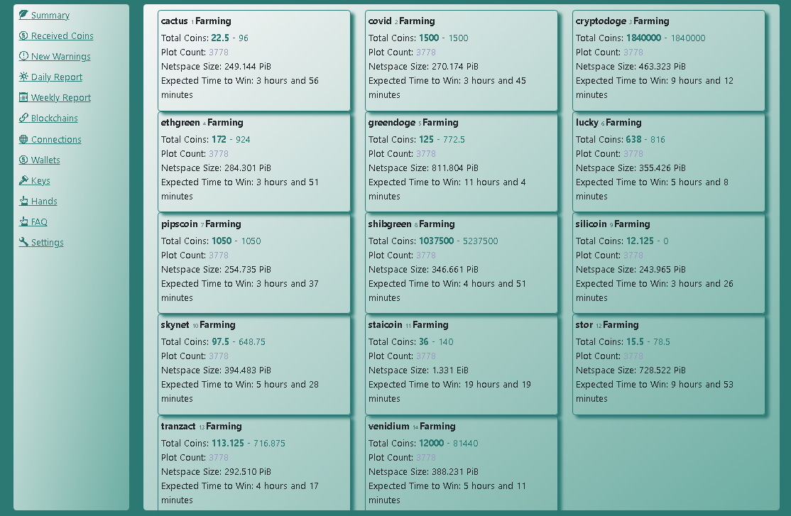
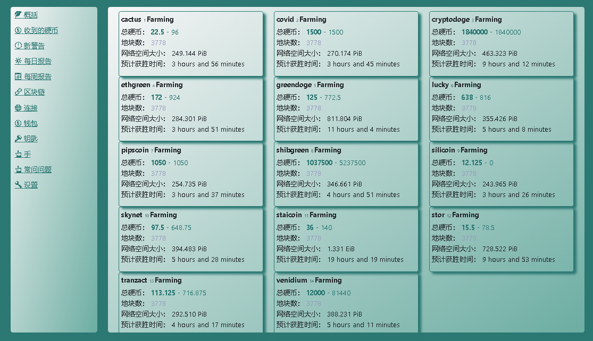
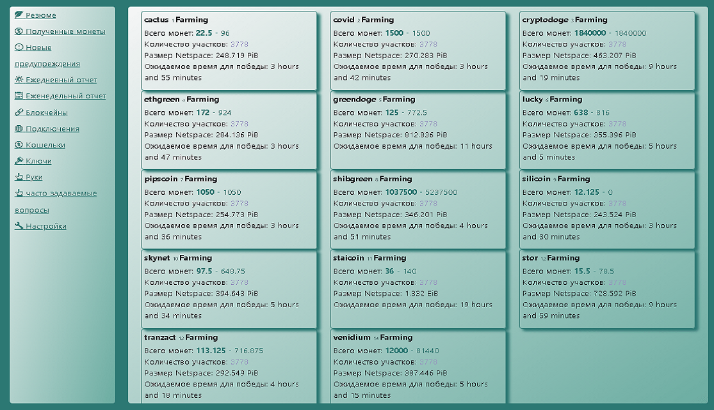
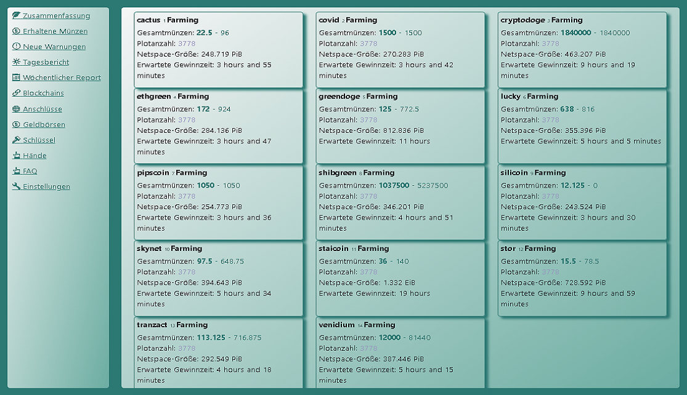

# Цоцтохуг - Управљајте десетинама цхиа блоцкцхаин форкс рударења из веб претраживача!
- Лепа локализација са подршком за десетине језика: [English](./readme_en.md), [العربية](./readme_ar.md), [Bulgarian](./readme_bg.md), [Catalan](./readme_ca.md), [Deutsch](./readme_de.md), [Español](./readme_es.md), [زبان فارسی](./readme_fa.md), [Français](./readme_fr.md), [Galego](./readme_gl.md), [Indonesian](./readme_id.md), [Italiano](./readme_it.md), [日本語](./readme_ja.md), [한국어](./readme_ko.md), [Português do Brasil](./readme_pt.md), [limba română](./readme_ro.md), [Русский](./readme_ru.md), [Serbian](./readme_sr.md), [Thai](./readme_th.md), [Tagalog (Filipino)](./readme_tl.md), [Türkçe](./readme_tr.md), [Українська](./readme_uk.md), [Vietnamese](./readme_vi.md), [简体中文](./readme_zh-CN.md), [繁體中文](./readme_zh-TW.md)
- Подржава: [cactus](https://github.com/raingggg/coctohug-cactus), [covid](https://github.com/raingggg/coctohug-covid), [cryptodoge](https://github.com/raingggg/coctohug-cryptodoge), [ethgreen](https://github.com/raingggg/coctohug-ethgreen), [flora](https://github.com/raingggg/coctohug-flora), [greendoge](https://github.com/raingggg/coctohug-greendoge), [lucky](https://github.com/raingggg/coctohug-lucky) [pipscoin](https://github.com/raingggg/coctohug-pipscoin), [shibgreen](https://github.com/raingggg/coctohug-shibgreen), [silicoin](https://github.com/raingggg/coctohug-silicoin), [skynet](https://github.com/raingggg/coctohug-skynet) [staicoin](https://github.com/raingggg/coctohug-staicoin), [stor](https://github.com/raingggg/coctohug-stor), [tranzact](https://github.com/raingggg/coctohug-tranzact), [venidium](https://github.com/raingggg/coctohug-venidium), и још...
- Ради на Линук-у, Виндовс-у, МацОС-у и још много тога...

Лако подешавање помоћу [Брз почетак](https://www.coctohug.xyz/) & [Командни менаџер Цоцтохуг](../ccm/ccm_sr.md)

*Потражите додатну помоћ на нашем [Website](https://www.coctohug.xyz/) / [Github](https://github.com/raingggg/coctohug) / [Discussions](https://github.com/raingggg/coctohug/discussions) / [Discord](https://discord.com/invite/RcVpCw3ef7)*.

*[Ево детаљнијег упутства за употребу](../wiki/wiki_sr.md)*

## Снимак екрана на енглеском

## Кинески снимак екрана

## Руссиан Сцреенсхот

## Немачки снимак екрана

# Пројекти отвореног кода на Гитхуб-у
| Coctohug Docker Source Code  | Blockain Forks Source Code  | Blockchain Community  | Coctohug Community  | Blockain Site  | Blockain Explorer  |
| ----------- | ----------- | ----------- | ----------- | ----------- | ----------- |
| [WebUI](https://github.com/raingggg/coctohug/tree/main/dockers/coctohug-web-docker) | [Github](https://github.com/raingggg/coctohug-web)  | [Discord](https://discord.com/invite/RcVpCw3ef7) | [Discord](https://discord.com/invite/RcVpCw3ef7) | [Site](https://www.coctohug.xyz/) | [Explorer](https://www.coctohug.xyz/)|
| [chia](https://github.com/raingggg/coctohug/tree/main/dockers/coctohug-chia) | [Github ](https://github.com/Chia-Network/chia-blockchain)  | Discord | [Discord](https://discord.com/invite/RcVpCw3ef7) | [Site](https://www.chia.net/) | [Explorer](https://alltheblocks.net/)|
| [cactus](https://github.com/raingggg/coctohug/tree/main/dockers/coctohug-cactus) | [Github ](https://github.com/Cactus-Network/cactus-blockchain)  | [Discord ](https://discord.gg/VAu4VfVkwg)  | [Discord](https://discord.com/invite/RcVpCw3ef7) | [Site](https://www.cactus-network.net/) | [Explorer](https://alltheblocks.net/)|
| [covid](https://github.com/raingggg/coctohug/tree/main/dockers/coctohug-covid) | [Github](https://github.com/pinksheetscrypto/covid-blockchain) | [Discord](https://discord.gg/5mFKC6DbXa) | [Discord](https://discord.com/invite/RcVpCw3ef7) | [Site](https://www.pinksheetscrypto.com/) | [Explorer](https://alltheblocks.net/)|
| [cryptodoge](https://github.com/raingggg/coctohug/tree/main/dockers/coctohug-cryptodoge) | [Github](https://github.com/CryptoDoge-Network/cryptodoge) | [Discord](https://discord.gg/fRBK4chVds) | [Discord](https://discord.com/invite/RcVpCw3ef7) | [Site](http://cryptodoge.cc/) | [Explorer](https://alltheblocks.net/)|
| [ethgreen](https://github.com/raingggg/coctohug/tree/main/dockers/coctohug-ethgreen) | [Github](https://github.com/ethgreen/ethgreen-blockchain) | [Discord](https://discord.gg/Fg9rZHRdcj) | [Discord](https://discord.com/invite/RcVpCw3ef7) | Site | [Explorer](https://alltheblocks.net/)|
| [flora](https://github.com/raingggg/coctohug/tree/main/dockers/coctohug-flora) | [Github](https://github.com/Flora-Network/flora-blockchain) | [Discord](https://discord.gg/GvwQhW4Yk3) | [Discord](https://discord.com/invite/RcVpCw3ef7) | [Site](http://floracoin.farm/) | [Explorer](https://alltheblocks.net/)|
| [greendoge](https://github.com/raingggg/coctohug/tree/main/dockers/coctohug-greendoge) | [Github](https://github.com/GreenDoge-Network/greendoge-blockchain) | [Discord](https://discord.gg/XmkZAMn8kj) | [Discord](https://discord.com/invite/RcVpCw3ef7) | [Site](https://greendoge.dog/) | [Explorer](https://alltheblocks.net/)|
| [lucky](https://github.com/raingggg/coctohug/tree/main/dockers/coctohug-lucky) | [Github](https://github.com/dream80/lucky-blockchain) | [Discord](https://discord.gg/pgdj4snppb) | [Discord](https://discord.com/invite/RcVpCw3ef7) | [Site](https://www.luckysix.top/) | [Explorer](https://alltheblocks.net/)|
| [pipscoin](https://github.com/raingggg/coctohug/tree/main/dockers/coctohug-pipscoin) | [Github](https://github.com/Pipscoin-Network/pipscoin-blockchain) | [Discord](https://discord.gg/T8taazt7Pf) | [Discord](https://discord.com/invite/RcVpCw3ef7) | [Site](https://www.pipscoin.net/) | [Explorer](https://alltheblocks.net/)|
| [shibgreen](https://github.com/raingggg/coctohug/tree/main/dockers/coctohug-shibgreen) | [Github](https://github.com/BTCgreen-Network/shibgreen-blockchain) | [Discord](https://discord.gg/PCyTa4CNx4) | [Discord](https://discord.com/invite/RcVpCw3ef7) | Site | [Explorer](https://alltheblocks.net/)|
| [silicoin](https://github.com/raingggg/coctohug/tree/main/dockers/coctohug-silicoin) | [Github](https://github.com/silicoin-network/silicoin-blockchain) | [Discord](https://discord.gg/p7GYjnUJdz) | [Discord](https://discord.com/invite/RcVpCw3ef7) | [Site](https://www.silicoin.cc/) | [Explorer](https://alltheblocks.net/)|
| [skynet](https://github.com/raingggg/coctohug/tree/main/dockers/coctohug-skynet) | [Github](https://github.com/SkynetNetwork/skynet-blockchain) | [Discord](https://discord.gg/8atUub5E5h) | [Discord](https://discord.com/invite/RcVpCw3ef7) | [Site](https://skynet-network.org/) | [Explorer](https://alltheblocks.net/)|
| [staicoin](https://github.com/raingggg/coctohug/tree/main/dockers/coctohug-staicoin) | [Github](https://github.com/STATION-I/staicoin-blockchain) | [Discord](https://discord.gg/7MhBBGaB3d) | [Discord](https://discord.com/invite/RcVpCw3ef7) | [Site](https://www.station-i.de/stai) | [Explorer](https://alltheblocks.net/)|
| [stor](https://github.com/raingggg/coctohug/tree/main/dockers/coctohug-stor) | [Github](https://github.com/Stor-Network/stor-blockchain) | [Discord](https://discord.gg/eXMCYDA3Xe) | [Discord](https://discord.com/invite/RcVpCw3ef7) | [Site](https://stor.network/) | [Explorer](https://alltheblocks.net/)|
| [tranzact](https://github.com/raingggg/coctohug/tree/main/dockers/coctohug-tranzact) | [Github](https://github.com/Tranzact-Network/tranzact-blockchain) | [Discord](https://discord.gg/XvvaamXuuF) | [Discord](https://discord.com/invite/RcVpCw3ef7) | [Site](https://tranzact.network/) | [Explorer](https://alltheblocks.net/)|
| [venidium](https://github.com/raingggg/coctohug/tree/main/dockers/coctohug-venidium) | [Github](https://github.com/Venidium-Network/venidium-blockchain) | [Discord](https://discord.gg/VsA7MX8awj) | [Discord](https://discord.com/invite/RcVpCw3ef7) | [Site](https://venidium.io/) | [Explorer](https://alltheblocks.net/)|
| [btcgreen](https://github.com/raingggg/coctohug/tree/main/dockers/coctohug-btcgreen) | [Github](https://github.com/BTCgreen-Network/btcgreen-blockchain) | [Discord](https://discord.gg/PKr7BcaWvx) | [Discord](https://discord.com/invite/RcVpCw3ef7) | [Site](https://www.btcgreen.us/) | [Explorer](https://alltheblocks.net/)|
| [hddcoin](https://github.com/raingggg/coctohug/tree/main/dockers/coctohug-hddcoin) | [Github](https://github.com/HDDcoin-Network/hddcoin-blockchain) | [Discord](https://discord.gg/ZTtQ9922zp) | [Discord](https://discord.com/invite/RcVpCw3ef7) | [Site](https://hddcoin.org/) | [Explorer](https://alltheblocks.net/)|
| [maize](https://github.com/raingggg/coctohug/tree/main/dockers/coctohug-maize) | [Github](https://github.com/Maize-Network/maize-blockchain) | [Discord](https://discord.gg/9GWRKHjTec) | [Discord](https://discord.com/invite/RcVpCw3ef7) | [Site](https://maize.farm/) | [Explorer](https://alltheblocks.net/)|
| [flax](https://github.com/raingggg/coctohug/tree/main/dockers/coctohug-flax) | [Github](https://github.com/Flax-Network/flax-blockchain) | [Discord](https://discord.gg/y3KqSdw8v2) | [Discord](https://discord.com/invite/RcVpCw3ef7) | [Site](https://flaxnetwork.org/) | [Explorer](https://alltheblocks.net/)|
| [aedge](https://github.com/raingggg/coctohug/tree/main/dockers/coctohug-aedge) | [Github](https://github.com/AedgeCoin/aedge-blockchain) | [Discord](https://discord.gg/m569ExDwXY) | [Discord](https://discord.com/invite/RcVpCw3ef7) | [Site](https://aedgecoin.com/) | [Explorer](https://alltheblocks.net/)|
| [apple](https://github.com/raingggg/coctohug/tree/main/dockers/coctohug-apple) | [Github](https://github.com/Apple-Network/apple-blockchain) | [Discord](https://discord.com/invite/RcVpCw3ef7) | [Discord](https://discord.com/invite/RcVpCw3ef7) | [Site](https://applecoin.in/) | [Explorer](https://alltheblocks.net/)|
| [wheat](https://github.com/raingggg/coctohug/tree/main/dockers/coctohug-wheat) | [Github](https://github.com/wheatnetwork/wheat-blockchain) | [Discord](https://discord.gg/rfYzrmqQTP) | [Discord](https://discord.com/invite/RcVpCw3ef7) | [Site](http://wheat.network/) | [Explorer](https://alltheblocks.net/)|
| [dogechia](https://github.com/raingggg/coctohug/tree/main/dockers/coctohug-dogechia) | [Github](https://github.com/DogeChia/doge-chia) | [Discord](https://discord.gg/ht3v4PYTyc) | [Discord](https://discord.com/invite/RcVpCw3ef7) | [Site](https://dogechia.org/) | [Explorer](https://alltheblocks.net/)|
| [tad](https://github.com/raingggg/coctohug/tree/main/dockers/coctohug-tad) | [Github](https://github.com/Tad-Network/tad-blockchain) | [Discord](https://discord.gg/vnxnXDZwTN) | [Discord](https://discord.com/invite/RcVpCw3ef7) | [Site](https://tadcoin.xyz/) | [Explorer](https://alltheblocks.net/)|
| [taco](https://github.com/raingggg/coctohug/tree/main/dockers/coctohug-taco) | [Github](https://github.com/Taco-Network/taco-blockchain) | [Discord](https://discord.gg/XRdzSyv5U9) | [Discord](https://discord.com/invite/RcVpCw3ef7) | [Site](https://taconetwork.net/) | [Explorer](https://alltheblocks.net/)|
| [socks](https://github.com/raingggg/coctohug/tree/main/dockers/coctohug-socks) | [Github](https://bitbucket.org/Socks-Network/socks-blockchain/src/main/) | [Discord](https://discord.gg/yteqP7PDTd) | [Discord](https://discord.com/invite/RcVpCw3ef7) | [Site](http://socks.works/) | [Explorer](https://alltheblocks.net/)|
| [mogua](https://github.com/raingggg/coctohug/tree/main/dockers/coctohug-mogua) | [Github](https://github.com/mogua-network/mogua-blockchain) | [Discord](https://discord.gg/G3eEamXY6T) | [Discord](https://discord.com/invite/RcVpCw3ef7) | Site | [Explorer](https://alltheblocks.net/)|
| [mint](https://github.com/raingggg/coctohug/tree/main/dockers/coctohug-mint) | [Github](https://github.com/MintNetwork/mint-blockchain) | [Discord](https://discord.gg/mR5DZ4yCRZ) | [Discord](https://discord.com/invite/RcVpCw3ef7) | [Site](https://mintnet.work/) | [Explorer](https://alltheblocks.net/)|
| [salvia](https://github.com/raingggg/coctohug/tree/main/dockers/coctohug-salvia) | [Github](https://github.com/Salvia-Network/salvia-blockchain) | [Discord](https://discord.gg/C9yHnxUkwd) | [Discord](https://discord.com/invite/RcVpCw3ef7) | [Site](https://salvianetwork.net/) | [Explorer](https://alltheblocks.net/)|
| [nchain](https://github.com/raingggg/coctohug/tree/main/dockers/coctohug-nchain) | [Github](https://gitee.com/ext9/ext9-blockchain) | [Discord](https://discord.gg/AdwYxxVnas) | [Discord](https://discord.com/invite/RcVpCw3ef7) | [Site](http://n-chain.org/) | [Explorer](https://alltheblocks.net/)|

## Обавештење о жиговима
ЦХИА НЕТВОРК ИНЦ, ЦХИА™, ЦХИА БЛОЦКЦХАИН™, ЦХИА ПРОТОЦОЛ™, ЦХИАЛИСП™ и „лого листа“ (укључујући само лого листа када се односи на или означава Цхиа), су заштитни знаци или регистровани заштитни знаци компаније Цхиа Нетворк, Инц. ., корпорација из Делавера. *Не постоји веза између овог пројекта Цоцтохуг и главног пројекта Цхиа Нетворк.*
