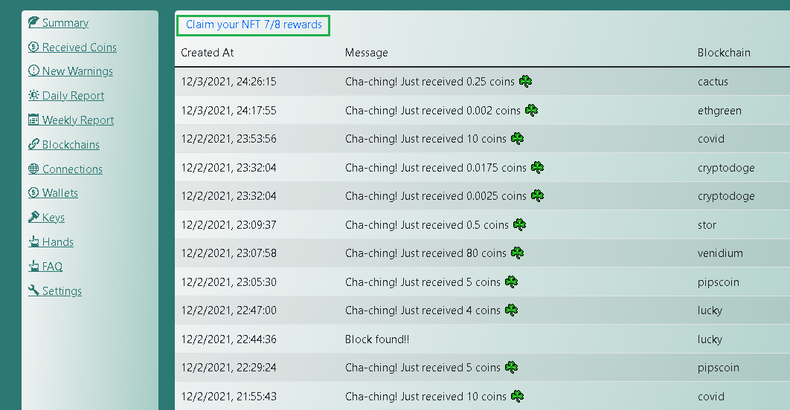
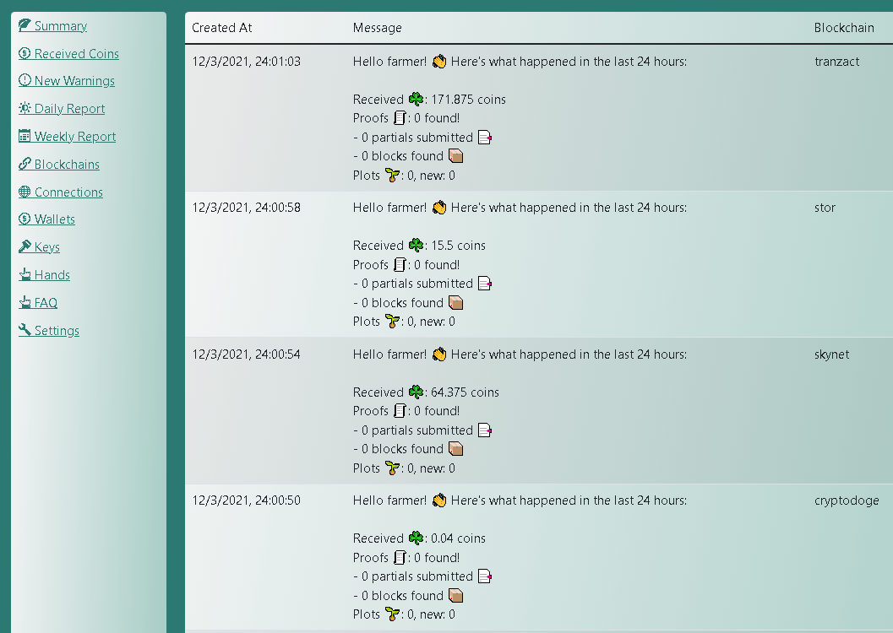
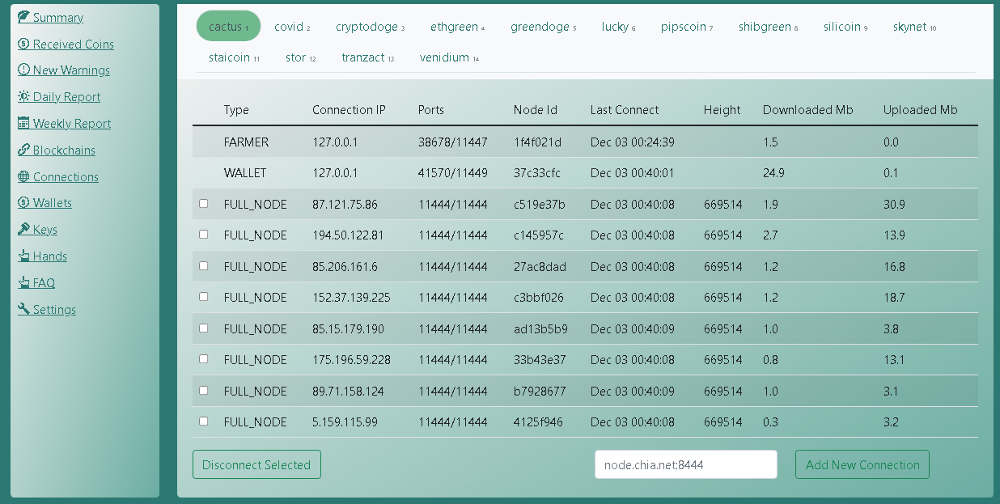
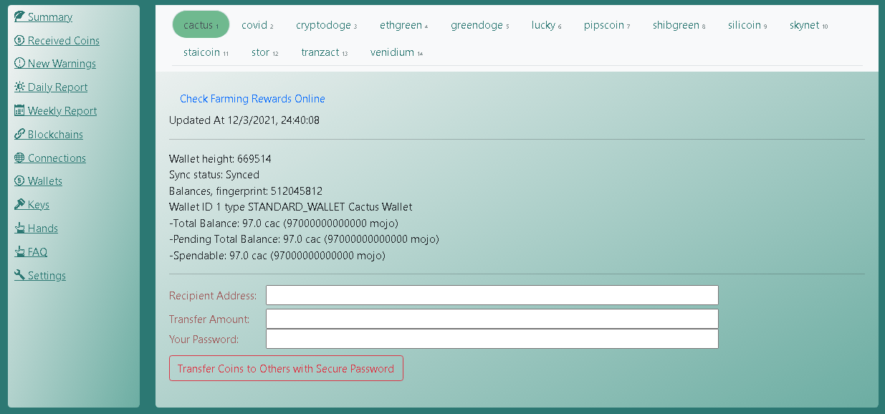

# Coctohug - Bir web tarayıcısından düzinelerce chia blockchain çatal madenciliğini yönetin!
- Düzinelerce dil desteğiyle güzel yerelleştirme: [English](./wiki_en.md), [العربية](./wiki_ar.md), [Bulgarian](./wiki_bg.md), [Catalan](./wiki_ca.md), [Deutsch](./wiki_de.md), [Español](./wiki_es.md), [زبان فارسی](./wiki_fa.md), [Français](./wiki_fr.md), [Galego](./wiki_gl.md), [Indonesian](./wiki_id.md), [Italiano](./wiki_it.md), [日本語](./wiki_ja.md), [한국어](./wiki_ko.md), [Português do Brasil](./wiki_pt.md), [limba română](./wiki_ro.md), [Русский](./wiki_ru.md), [Serbian](./wiki_sr.md), [Thai](./wiki_th.md), [Tagalog (Filipino)](./wiki_tl.md), [Türkçe](./wiki_tr.md), [Українська](./wiki_uk.md), [Vietnamese](./wiki_vi.md), [简体中文](./wiki_zh-CN.md), [繁體中文](./wiki_zh-TW.md)

Kullanımı Kolay Kurulum [Hızlı başlangıç](https://www.coctohug.xyz/)

*Bizimle ilgili daha fazla yardım isteyin [Website](https://www.coctohug.xyz/) / [Github](https://github.com/raingggg/coctohug) / [Discussions](https://github.com/raingggg/coctohug/discussions) / [Discord](https://discord.com/invite/RcVpCw3ef7)*.

# Hızlı başlangıç
  - [Linux işletim sisteminde Coctohug&#39;u kurun](#cch-linux)
  - [Windows işletim sisteminde Coctohug&#39;u kurun](#cch-windows)
  - [Mac OS&#39;de Coctohug&#39;u Kurma](#cch-macOS)
  

# Genel Ayarlar
  - [Parola](#cch-password)
  - [Anahtarlar](#cch-keys)
  - [Düğüm Senkronizasyonu](#cch-node_sync)
  - [madencilik](#cch-farming)
  - [izleme](#cch-monitoring)
  - [NFT Kurtarma](#cch-nft_recovery)
  - [Bulunan Bloklar / Alınan Paralar](#cch-blocks_found)
  - [Madencilik Uyarıları](#cch-farming_warnings)
  - [Günlük rapor](#cch-daily_report)
  - [Haftalık rapor](#cch-weekly_report)
  - [Bağlantı Yönetimi](#cch-connections_management)
  - [Cüzdan Yönetimi](#cch-wallets_management)
  - [El Yönetimi](#cch-hands_management)
  - [Para Transferi](#cch-transfer_coins)


# Gelişmiş Ayarlar
  - [Soğuk Cüzdan](#cch-cold_wallet)
  - [Güvenli Parolalı 24 Anımsatıcı Söz](#cch-secure_passphrase)
  - [Blockchain Çatalları](#cch-forks)
  - [biçerdöver](#cch-harvester)
  - [Güncelleme](#cch-upgrade)

# En İyi Uygulamalar
  - [Yerel dil](#cch-local_language)
  - [Donanım Gereksinimleri](#cch-hardware_requirements)

<p id="cch-linux">&nbsp;</p>

## Linux işletim sisteminde Coctohug&#39;u kurun
- Kurmak <a target='_blank' href='https://www.docker.com/products/docker-desktop'>Docker</a> + <a target='_blank' href='https://docs.docker.com/compose/install/'>Docker-Compose</a> 
- siteye git <a target='_blank' href='https://www.coctohug.xyz/'>https://www.coctohug.xyz</a>, ardından gerekli tüm form alanlarını girin ve oluşturulan sıkıştırılmış docker-compose dosyalarını indirin
- İndirdiğiniz klasörleri açın ve çalışma dizininize kopyalayın. Bilgisayarın kaynaklarının tükenmesini önlemek için lütfen bu istenmeyen blok zinciri çatal klasörlerini de kaldırın.
- Blok zinciri çatallarını benzer komut dosyalarıyla kurun:
  ```
  ./ccm.sh start flora
  ./ccm.sh start flax
  ./ccm.sh start hddcoin
  ./ccm.sh start chia
  ...
  ```
- Tarayıcıyı açın ve url ile WebUI&#39;ye erişin <a target='_blank' href='http://localhost:12630/'>http://localhost:12630/</a>
- Not 1: Chia blok zinciri çatalları, düğüm senkronizasyonu ilk kez yapıldığında gerçekten CPU yediğinden, aynı anda 5&#39;ten fazla blok zinciri çatalı başlatmayın.
- Not 2: Her blok zinciri çatalı için yaklaşık 1.8G RAM gereklidir, bu nedenle bilgisayar belleğinize göre bazı blok zincir çatalları seçin
- Not 3: Herhangi bir sorun varsa, tüm blockchain çatallarını yeniden başlatmanız gerekebilir:
  ```
  ./ccm.sh restart flora
  ./ccm.sh restart flax
  ./ccm.sh restart hddcoin
  ./ccm.sh restart chia
  ...
  ```
- Not 4: Sistem güvenlik duvarı ayarlarınıza 12630&#39;dan 12700&#39;e kadar izin verilen bağlantı noktaları eklemeniz gerekebilir.
- Not 5: Lütfen bu istenmeyen blockchain çatalları klasörünü coctohug klasöründen çıkarmayı unutmayın. Aksi takdirde, çalışan tüm blok zinciri çatalları üzerinde çalıştığınızda aynı anda başlatılırlar ve bu da bilgisayarınızın kaynaklarının tükenmesine neden olabilir.
  ```
  ./ccm.sh start all
  ./ccm.sh restart all
  ./ccm.sh stop all
  ./ccm.sh upgrade all
  ...


<p id="cch-windows">&nbsp;</p>

## Windows işletim sisteminde Coctohug&#39;u kurun
- Çoğu adım aynı [Linux işletim sisteminde Coctohug&#39;u kurun](#cch-linux)
- Blok zinciri çatallarını benzer komut dosyalarıyla kurun:
  ```
  .\ccm.ps1 start flora
  .\ccm.ps1 start flax
  .\ccm.ps1 start hddcoin
  .\ccm.ps1 start chia
  ...
  ```

<p id="cch-macOS">&nbsp;</p>

## Mac OS&#39;de Coctohug&#39;u Kurma
- İle aynı [Linux işletim sisteminde Coctohug&#39;u kurun](#cch-linux)

<p id="cch-password">&nbsp;</p>

## Parola
- URL ile WebUI&#39;ye ilk kez eriştiğinizde, güvenli ayarlar için bir parola belirlemeniz istenecektir. <a target='_blank' href='http://localhost:12630/'>http://localhost:12630/</a>
- Güvenli ayarlar şunları içerir: Cold Wallet, Coin Transfer, Restart Blockchain Forks, Harvester...

<p id="cch-keys">&nbsp;</p>

## Anahtarlar
- URL ile WebUI&#39;ye ilk kez eriştiğinizde, 24 anımsatıcı kelimeyi girmeniz istenecektir - bu esas olarak çiftçilik amaçlıdır
- Veya tamamen yeni bir anahtar oluşturabilirsiniz - bu esas olarak soğuk cüzdan amaçlıdır

<p id="cch-farming">&nbsp;</p>

## madencilik
- Düğüm senkronizasyonu yapıldığında, çiftçilik otomatik olarak başlamalıdır
- Ardından madencilik durumunu çeşitli yollarla izleyebileceksiniz.


<p id="cch-monitoring">&nbsp;</p>

## izleme
- Özet sekmesi şunları gösterebilir: Toplam Maden Paraları, Hesap Bakiyesi, Arsa Sayısı, Arsa Boyutu, Netspace Boyutu ve Beklenen Kazanma Süresi
- Özet sekmesindeki her blok zinciri çatal paneli, düzgün çalışıyorsa açık yeşil bir arka plana sahip olacaktır, aksi takdirde açık sarı arka plana sahip olacaktır.
- Detayları diğer sekmeleri kullanarak da inceleyebilirsiniz.

<p id="cch-nft_recovery">&nbsp;</p>

## NFT Kurtarma
- Alınan Paralar sekmesinde bir bağlantı bulunur: <a class="nav-link" target="_blank" href="https://alltheblocks.net/nft-recovery">NFT 7/8 ödüllerinizi talep edin</a>

<p id="cch-blocks_found">&nbsp;</p>

## Bulunan Bloklar / Alınan Paralar
- Bulunan toplam blokları listele
- Alınan toplam paraları listele




<p id="cch-farming_warnings">&nbsp;</p>

## Madencilik Uyarıları
- Olası ağ sorununu listeleyin
- Olası işaret noktası sorununu listeleyin
- Olası disk arama sorununu listeleyin
- Olası arsa sayısı azalan sorunu listeleyin

<p id="cch-daily_report">&nbsp;</p>

## Günlük rapor
- Bulunan Blokları / Güne Göre Alınan Paraları Özetle
- Madencilik Uyarılarını güne göre özetleyin




<p id="cch-weekly_report">&nbsp;</p>

## Haftalık rapor
- Bulunan Blokları / Haftaya Göre Alınan Paraları Özetle
- Madencilik Uyarılarını Haftaya Göre Özetleyin

<p id="cch-node_sync">&nbsp;</p>

## Düğüm Senkronizasyonu
- Düğüm varsayılan olarak otomatik olarak eşitlenir
- Ayrıntılı durumu incelemek için Bağlantılar veya Blokajlar sekmesine gidebilirsiniz.
- Düğüm senkronizasyonunuzu hızlandırmak için: [Coctohug site](https://www.coctohug.xyz/#dbFilesAndOpenSources) veritabanı dosya bağlantıları sağlar - tarafından geliştirilen ve desteklenen: [Maize fork](https://chiaforksblockchain.com/)
  ```
  1. Dosyaları indirin: blockchain_v1_mainnet.sqlite ve peer_table_node.sqlite
  2. Blok zinciri çatalını benzer terminal komut dosyasıyla durdurun (her klasörün içinde):
    Windows: .\ccm.ps1 stop all
    Linux / Mac: ./ccm.sh stop all
  3. Bu dosyaları aşağıdakine benzer şekilde blockchain çatal klasörüne kopyalayın:
    Windows: /c:/users/username/.coctohug-covid/covid/mainnet/db/
    Linux / Mac: /home/username/.coctohug-flora/flora/mainnet/db/
  4. Blok zinciri çatalını benzer terminal komut dosyasıyla başlatın (her klasörün içinde):
     Windows: .\ccm.ps1 restart all
     Linux / Mac: ./ccm.sh restart all
  Notlar 1: Cüzdanınızın çatal programında bireysel senkronizasyona ihtiyacı var
  Not 2: İndirilen veritabanının blok zinciri çatalınıza bağlanması 30 dakika kadar sürebilir!
  ```

<p id="cch-connections_management">&nbsp;</p>

## Bağlantı Yönetimi
- Tüm düğüm bağlantılarını listele
- Bağlantılar sekmesinde bağlantı ekleyebilir/kaldırabilirsiniz




<p id="cch-wallets_management">&nbsp;</p>

## Cüzdan Yönetimi
- Cüzdan durumunu ve hesap bakiyesini listeleyin
- Paraları cüzdan sekmesinden de aktarabilirsiniz.




<p id="cch-hands_management">&nbsp;</p>

## El Yönetimi
- Bu, her bir blockchain çatal işçisi
- Artık çiftlik yapmayı planlamadığınızda bir elinizi kaldırabilirsiniz.


<p id="cch-transfer_coins">&nbsp;</p>

## Para Transferi
- Cüzdan sekmesine gidin ve madeni paraları aktarmak için güvenli şifrenizi girin

<p id="cch-cold_wallet">&nbsp;</p>

## Soğuk Cüzdan
- Güvenli şifrenizle ayarlar sekmesine gidin
- Soğuk Cüzdan Hesabını Dışa Aktar
  ```
  1. Yeni bir makine hazırlayın (madencilik makinesinden farklı)
  2. Ziyaret https://www.coctohug.xyz ve docker-compose klasörleri oluşturmak için Cüzdan Modu&#39;nu tıklayın
  3. Docker-compose klasörlerini kurun [Linux işletim sisteminde Coctohug&#39;u kurun]
  4. WebUI başlatma ekranında bu sefer yeni bir anahtar oluşturun
  5. Blockchain çatallarının yeniden başlatılması için birkaç dakika bekleyin
  6. Ziyaret http://localhost:12630/, ve soğuk cüzdan adreslerini dışa aktarmak için ayarlar - soğuk cüzdan sekmesine gidin
  7. İndirilen dosyayı Anahtarlar sekmesinde gösterilen bilgilerle karşılaştırarak her adresin manuel olarak doğru olduğunu onaylayın.
  8. Benzer terminal komut dosyasıyla 24 anımsatıcı kelime alın
    docker exec -it coctohug-flora flora keys show --show-mnemonic-seed
    docker exec -it coctohug-covid covid keys show --show-mnemonic-seed
    docker exec -it coctohug-lucky lucky keys show --show-mnemonic-seed
  ```
- Soğuk Cüzdan Hesabını İçe Aktar
  ```
  1. Madencilik makinenizde ayarlar - soğuk cüzdan sekmesini ziyaret edin
  2. Daha önce indirilen soğuk cüzdanı (farklı makinelerde önerilir) json dosyasını içe aktarın
  3. Birkaç dakika bekleyin ve soğuk cüzdan adresinin güncellenip güncellenmediğini görmek için cüzdan sekmesine gidin.
  4. Not 1: İçe aktarmadan önce cüzdan yapılandırmalarınızı yedeklemenizi öneririz.
  5. Not 2: Yalnızca çalışan blok zinciri çatalları, soğuk cüzdanı içe aktarabilir. Lütfen bunu yapmadan önce blok zinciri çatallarının durup durmadığını kontrol edin. Elbette daha sonra yeniden başlatıldıklarında tekrar içe aktarabilirsiniz.
  6. Not 3: Herhangi bir sorun varsa, tüm blockchain çatallarını yeniden başlatmanız gerekebilir:
    Windows: .\ccm.ps1 restart all
    Linux / Mac: ./ccm.sh restart all
  ```


<p id="cch-secure_passphrase">&nbsp;</p>

## Güvenli Parolalı 24 Anımsatıcı Söz
- <a target='_blank' href='https://github.com/raingggg/coctohug-passphrase'>coctohug-passphrase</a> 24 anımsatıcı kelimenizi güvenceye almak için kullanılabilir
- Anahtarlarınızı yalnızca sizin bildiğiniz bir parola ile şifreler
- Yeni blockchain çatalları eklerken şifre ile şifresini çözebilirsiniz.

<p id="cch-forks">&nbsp;</p>

## Blockchain Çatalları
- Coctohug github&#39;ı birkaç günde bir kontrol edin
- Yeni blockchain çatalları çok yakında desteklenecek
  
<p id="cch-harvester">&nbsp;</p>

## biçerdöver
- Ziyaret <a target='_blank' href='https://www.coctohug.xyz/'>https://www.coctohug.xyz</a> ve docker-compose klasörleri oluşturmak için Harvester Mode&#39;a tıklayın
- Ziyaret <a target='_blank' href='http://localhost:12630/'>http://localhost:12630/</a> ve biçerdöver ile kontrolör arasındaki bağlantıyı kurmasına izin ver&#39;i tıklayın.
- Docker-compose klasörlerini kurun [Linux işletim sisteminde Coctohug&#39;u kurun](#cch-linux)
- Birkaç dakika sonra, hasat makinesini WebUI eller sekmesinde görebileceksiniz.

<p id="cch-upgrade">&nbsp;</p>

## Güncelleme
- Bunun için tekrar 24 anımsatıcı kelimeye ihtiyacı var. Lütfen bunları /home/user/.coctohug/mnc.txt dosyasına koyun. Tüm yeni docker kapsayıcıları başlatıldıktan sonra, güvenlik düzeyinizi artırmak için mnc.txt dosyasını boşaltabilirsiniz.
- Tek satırlık komut dosyası
  ```
  Windows: .\ccm.ps1 upgrade all; .\ccm.ps1 start all
  Linux / Mac: ./ccm.sh upgrade all && ./ccm.sh start all
  ```
- Ayrıca yukarıdaki komut dosyalarını adım adım çalıştırabilirsiniz.
  ```
  .\ccm.ps1 upgrade all
  .\ccm.ps1 start all
  ```
- Uyumsuz db sorunu olması durumunda, docker-compose başlatma komut dosyasını çalıştırmadan önce mevcut veritabanı dosyasını şu şekilde kaldırabilirsiniz:
  ```
  rm ~/.coctohug-web/db/coctohug.sqlite
  ```

<p id="cch-local_language">&nbsp;</p>

## Yerel dil
- WebUI&#39;nin sağ üst köşesinde, en çok beğendiğiniz dili seçin
- Dilerseniz daha sonra başka dillere geçebilirsiniz.
  
  
<p id="cch-hardware_requirements">&nbsp;</p>

## Donanım Gereksinimleri
- Senkronize edildikten sonra, 10. Nesil Intel® Core™ i7 İşlemciler, 50&#39;den fazla blok zinciri çatalı oluşturmak için yeterli olacaktır.
- Ancak ilk düğüm senkronizasyon aşaması için gerçekten CPU yiyor. Bu nedenle, grup başına 5 blok zinciri çatalı kurmanızı ve gruplara göre grup başlatmanızı öneririz.
- Gerekli bellek şuna eşittir: madencilik blok zinciri çatallarının sayısı 1.8G RAM ile çarpılır
- 50&#39;den fazla blockchain çatalı için normal disk iyi olmalıdır


# Github&#39;da Açık Kaynak Projeleri
| Coctohug Docker Source Code  | Blockain Forks Source Code  | Blockchain Community  | Coctohug Community  | Blockain Site  | Blockain Files  | Blockain Explorer  |
| ----------- | ----------- | ----------- | ----------- | ----------- | ----------- | ----------- |
| [WebUI](https://github.com/raingggg/coctohug-web-docker) | [Github](https://github.com/raingggg/coctohug-web)  | [Discord](https://discord.com/invite/RcVpCw3ef7) | [Discord](https://discord.com/invite/RcVpCw3ef7) | [Site](https://www.coctohug.xyz/) | [Files](https://www.coctohug.xyz/) | [Explorer](https://www.coctohug.xyz/)|
| [chia](https://github.com/raingggg/coctohug-chia) | [Github ](https://github.com/Chia-Network/chia-blockchain)  | Discord | [Discord](https://discord.com/invite/RcVpCw3ef7) | [Site](https://www.chia.net/) | Files | [Explorer](https://alltheblocks.net/)|
| [cactus](https://github.com/raingggg/coctohug-cactus) | [Github ](https://github.com/Cactus-Network/cactus-blockchain)  | [Discord ](https://discord.gg/VAu4VfVkwg)  | [Discord](https://discord.com/invite/RcVpCw3ef7) | [Site](https://www.cactus-network.net/) | [Files](https://mega.nz/folder/u7wSDJYT#9KGpDVOGGK5-frBBI1v_Rg) | [Explorer](https://alltheblocks.net/)|
| [covid](https://github.com/raingggg/coctohug-covid) | [Github](https://github.com/pinksheetscrypto/covid-blockchain) | [Discord](https://discord.gg/5mFKC6DbXa) | [Discord](https://discord.com/invite/RcVpCw3ef7) | [Site](https://www.pinksheetscrypto.com/) | [Files](https://mega.nz/folder/K24wiK7D#Qw_HJqs7ZX9A8fWQtmzZfQ) | [Explorer](https://alltheblocks.net/)|
| [cryptodoge](https://github.com/raingggg/coctohug-cryptodoge) | [Github](https://github.com/CryptoDoge-Network/cryptodoge) | [Discord](https://discord.gg/fRBK4chVds) | [Discord](https://discord.com/invite/RcVpCw3ef7) | [Site](http://cryptodoge.cc/) | [Files](https://mega.nz/folder/T75UDKpA#dLVq8OhdsjK5kPxNwCaP8Q) | [Explorer](https://alltheblocks.net/)|
| [ethgreen](https://github.com/raingggg/coctohug-ethgreen) | [Github](https://github.com/ethgreen/ethgreen-blockchain) | [Discord](https://discord.gg/Fg9rZHRdcj) | [Discord](https://discord.com/invite/RcVpCw3ef7) | Site | [Files](https://mega.nz/folder/GyxCzIDb#vWioPeCQ5QVkbqHduQA9oA) | [Explorer](https://alltheblocks.net/)|
| [flora](https://github.com/raingggg/coctohug-flora) | [Github](https://github.com/Flora-Network/flora-blockchain) | [Discord](https://discord.gg/GvwQhW4Yk3) | [Discord](https://discord.com/invite/RcVpCw3ef7) | [Site](http://floracoin.farm/) | [Files](https://mega.nz/folder/CjpSzYzR#7MR4AHEP2nFkaJa6cy45gg) | [Explorer](https://alltheblocks.net/)|
| [greendoge](https://github.com/raingggg/coctohug-greendoge) | [Github](https://github.com/GreenDoge-Network/greendoge-blockchain) | [Discord](https://discord.gg/XmkZAMn8kj) | [Discord](https://discord.com/invite/RcVpCw3ef7) | [Site](https://greendoge.dog/) | [Files](https://mega.nz/folder/SywmzIDI#wOyzuaQN_3jxUJY3f-Dypg) | [Explorer](https://alltheblocks.net/)|
| [lucky](https://github.com/raingggg/coctohug-lucky) | [Github](https://github.com/dream80/lucky-blockchain) | [Discord](https://discord.gg/pgdj4snppb) | [Discord](https://discord.com/invite/RcVpCw3ef7) | [Site](https://www.luckysix.top/) | [Files](https://mega.nz/folder/WnpS0YRT#CSg5qMEknE9cWImAAdlPLw) | [Explorer](https://alltheblocks.net/)|
| [pipscoin](https://github.com/raingggg/coctohug-pipscoin) | [Github](https://github.com/Pipscoin-Network/pipscoin-blockchain) | [Discord](https://discord.gg/T8taazt7Pf) | [Discord](https://discord.com/invite/RcVpCw3ef7) | [Site](https://www.pipscoin.net/) | [Files](https://mega.nz/folder/irhGxQ6Z#UMA2Ir_x7pSTrvj5SIoiHQ) | [Explorer](https://alltheblocks.net/)|
| [shibgreen](https://github.com/raingggg/coctohug-shibgreen) | [Github](https://github.com/BTCgreen-Network/shibgreen-blockchain) | [Discord](https://discord.gg/PCyTa4CNx4) | [Discord](https://discord.com/invite/RcVpCw3ef7) | Site | [Files](https://mega.nz/folder/SnhEXJLT#HkbG3IhiWzFbABSmYb6lTA) | [Explorer](https://alltheblocks.net/)|
| [silicoin](https://github.com/raingggg/coctohug-silicoin) | [Github](https://github.com/silicoin-network/silicoin-blockchain) | [Discord](https://discord.gg/p7GYjnUJdz) | [Discord](https://discord.com/invite/RcVpCw3ef7) | [Site](https://www.silicoin.cc/) | [Files](https://mega.nz/folder/Wy52jaZB#nwo0FmY3XMxdTMvtvLwDcw) | [Explorer](https://alltheblocks.net/)|
| [skynet](https://github.com/raingggg/coctohug-skynet) | [Github](https://github.com/SkynetNetwork/skynet-blockchain) | [Discord](https://discord.gg/8atUub5E5h) | [Discord](https://discord.com/invite/RcVpCw3ef7) | [Site](https://skynet-network.org/) | [Files](https://mega.nz/folder/irp0VK7Q#KUlqWB5jfu7RrwDczXt8Kw) | [Explorer](https://alltheblocks.net/)|
| [staicoin](https://github.com/raingggg/coctohug-staicoin) | [Github](https://github.com/STATION-I/staicoin-blockchain) | [Discord](https://discord.gg/7MhBBGaB3d) | [Discord](https://discord.com/invite/RcVpCw3ef7) | [Site](https://www.station-i.de/stai) | [Files](https://mega.nz/folder/OqgSjYCY#MCwYdt3YnnHA2C6gJV6lvw) | [Explorer](https://alltheblocks.net/)|
| [stor](https://github.com/raingggg/coctohug-stor) | [Github](https://github.com/Stor-Network/stor-blockchain) | [Discord](https://discord.gg/eXMCYDA3Xe) | [Discord](https://discord.com/invite/RcVpCw3ef7) | [Site](https://stor.network/) | [Files](https://mega.nz/folder/mr52AapZ#d91-gZoq6auEOWFbcqn8uQ) | [Explorer](https://alltheblocks.net/)|
| [tranzact](https://github.com/raingggg/coctohug-tranzact) | [Github](https://github.com/Tranzact-Network/tranzact-blockchain) | [Discord](https://discord.gg/XvvaamXuuF) | [Discord](https://discord.com/invite/RcVpCw3ef7) | [Site](https://tranzact.network/) | [Files](https://mega.nz/folder/fiogwYzT#YtwnJku9fe59FgCLpweeVw) | [Explorer](https://alltheblocks.net/)|
| [venidium](https://github.com/raingggg/coctohug-venidium) | [Github](https://github.com/Venidium-Network/venidium-blockchain) | [Discord](https://discord.gg/VsA7MX8awj) | [Discord](https://discord.com/invite/RcVpCw3ef7) | [Site](https://venidium.io/) | [Files](https://mega.nz/folder/ijhC0apB#hu4b1pAL6W6atEaR3H3f_Q) | [Explorer](https://alltheblocks.net/)|
| [btcgreen](https://github.com/raingggg/coctohug-btcgreen) | [Github](https://github.com/BTCgreen-Network/btcgreen-blockchain) | [Discord](https://discord.gg/PKr7BcaWvx) | [Discord](https://discord.com/invite/RcVpCw3ef7) | [Site](https://www.btcgreen.us/) | [Files](https://mega.nz/folder/uvoEhaaJ#ozryRZYe2wIx-9eyx84nxQ) | [Explorer](https://alltheblocks.net/)|
| [hddcoin](https://github.com/raingggg/coctohug-hddcoin) | [Github](https://github.com/HDDcoin-Network/hddcoin-blockchain) | [Discord](https://discord.gg/ZTtQ9922zp) | [Discord](https://discord.com/invite/RcVpCw3ef7) | [Site](https://hddcoin.org/) | [Files](https://mega.nz/folder/Hu5miQpa#KAZPquVHG6pfYC5k0-qlsA) | [Explorer](https://alltheblocks.net/)|
| [maize](https://github.com/raingggg/coctohug-maize) | [Github](https://github.com/Maize-Network/maize-blockchain) | [Discord](https://discord.gg/9GWRKHjTec) | [Discord](https://discord.com/invite/RcVpCw3ef7) | [Site](https://maize.farm/) | [Files](https://mega.nz/folder/W7YWUBzJ#7pTVcC2F_a7zFCJCMbbDKw) | [Explorer](https://alltheblocks.net/)|
| [flax](https://github.com/raingggg/coctohug-flax) | [Github](https://github.com/Flax-Network/flax-blockchain) | [Discord](https://discord.gg/y3KqSdw8v2) | [Discord](https://discord.com/invite/RcVpCw3ef7) | [Site](https://flaxnetwork.org/) | [Files](https://mega.nz/folder/impAUA6K#u82XUxLXyicpfEH-CDajyQ) | [Explorer](https://alltheblocks.net/)|
| [aedge](https://github.com/raingggg/coctohug-aedge) | [Github](https://github.com/AedgeCoin/aedge-blockchain) | [Discord](https://discord.gg/m569ExDwXY) | [Discord](https://discord.com/invite/RcVpCw3ef7) | [Site](https://aedgecoin.com/) | [Files](https://mega.nz/folder/in5URKrI#URsKl-G8pfcE2evUFZL1Zw) | [Explorer](https://alltheblocks.net/)|
| [apple](https://github.com/raingggg/coctohug-apple) | [Github](https://github.com/Apple-Network/apple-blockchain) | [Discord](https://discord.com/invite/RcVpCw3ef7) | [Discord](https://discord.com/invite/RcVpCw3ef7) | [Site](https://applecoin.in/) | [Files](https://mega.nz/folder/vioAUQQZ#Y99I47Mz4IRAg68JsMl1Ow) | [Explorer](https://alltheblocks.net/)|
| [wheat](https://github.com/raingggg/coctohug-wheat) | [Github](https://github.com/wheatnetwork/wheat-blockchain) | [Discord](https://discord.gg/rfYzrmqQTP) | [Discord](https://discord.com/invite/RcVpCw3ef7) | [Site](http://wheat.network/) | [Files](https://mega.nz/folder/37oUESqT#fVhlY1qZXfTzXXZsaeUo2A) | [Explorer](https://alltheblocks.net/)|
| [dogechia](https://github.com/raingggg/coctohug-dogechia) | [Github](https://github.com/DogeChia/doge-chia) | [Discord](https://discord.gg/ht3v4PYTyc) | [Discord](https://discord.com/invite/RcVpCw3ef7) | [Site](https://dogechia.org/) | [Files](https://mega.nz/folder/auoU3YrZ#2ILW03LPw2Z_tdqWCNCA0Q) | [Explorer](https://alltheblocks.net/)|
| [tad](https://github.com/raingggg/coctohug-tad) | [Github](https://github.com/Tad-Network/tad-blockchain) | [Discord](https://discord.gg/vnxnXDZwTN) | [Discord](https://discord.com/invite/RcVpCw3ef7) | [Site](https://tadcoin.xyz/) | [Files](https://mega.nz/folder/mmxwRAiT#de5HGjji2VqkQVDwDvmoKQ) | [Explorer](https://alltheblocks.net/)|
| [taco](https://github.com/raingggg/coctohug-taco) | [Github](https://github.com/Taco-Network/taco-blockchain) | [Discord](https://discord.gg/XRdzSyv5U9) | [Discord](https://discord.com/invite/RcVpCw3ef7) | [Site](https://taconetwork.net/) | [Files](https://mega.nz/folder/br4EUQAA#4I3etq8dIM8EtcthuBH1xw) | [Explorer](https://alltheblocks.net/)|
| [socks](https://github.com/raingggg/coctohug-socks) | [Github](https://bitbucket.org/Socks-Network/socks-blockchain/src/main/) | [Discord](https://discord.gg/yteqP7PDTd) | [Discord](https://discord.com/invite/RcVpCw3ef7) | [Site](http://socks.works/) | Files | [Explorer](https://alltheblocks.net/)|
| [mogua](https://github.com/raingggg/coctohug-mogua) | [Github](https://github.com/mogua-network/mogua-blockchain) | [Discord](https://discord.gg/G3eEamXY6T) | [Discord](https://discord.com/invite/RcVpCw3ef7) | Site | [Files](https://mega.nz/folder/nmwGXCCS#LQHaKL-4YbujnHJZzUUEGQ) | [Explorer](https://alltheblocks.net/)|
| [mint](https://github.com/raingggg/coctohug-mint) | [Github](https://github.com/MintNetwork/mint-blockchain) | [Discord](https://discord.gg/mR5DZ4yCRZ) | [Discord](https://discord.com/invite/RcVpCw3ef7) | [Site](https://mintnet.work/) | [Files](https://mega.nz/folder/H6oCWICS#bpa_tgPiMj1ChkgpiEV2CQ) | [Explorer](https://alltheblocks.net/)|
| [salvia](https://github.com/raingggg/coctohug-salvia) | [Github](https://github.com/Salvia-Network/salvia-blockchain) | [Discord](https://discord.gg/C9yHnxUkwd) | [Discord](https://discord.com/invite/RcVpCw3ef7) | [Site](https://salvianetwork.net/) | [Files](https://mega.nz/folder/O35WGSSI#ftadMcOnzk2lnkw1xSgURw) | [Explorer](https://alltheblocks.net/)|
| [nchain](https://github.com/raingggg/coctohug-nchain) | [Github](https://gitee.com/ext9/ext9-blockchain) | [Discord](https://discord.gg/AdwYxxVnas) | [Discord](https://discord.com/invite/RcVpCw3ef7) | [Site](http://n-chain.org/) | [Files](https://downloads.chiaforksblockchain.com/folder/7036b1df1c2fe0ea21f4a9f6c814634d/content) | [Explorer](https://alltheblocks.net/)|


## Ticari Marka Bildirimi
CHIA NETWORK INC, CHIA™, CHIA BLACKCHAIN™, CHIA PROTOCOL™, CHIALISP™ ve “yaprak Logosu” (Chia&#39;ya atıfta bulunduğunda veya Chia&#39;yı gösterdiğinde yalnızca yaprak logosu dahil), Chia Network, Inc&#39;in ticari markaları veya tescilli ticari markalarıdır. ., bir Delaware şirketi. *Bu Coctohug projesi ile ana Chia Network projesi arasında herhangi bir bağlantı yoktur.*